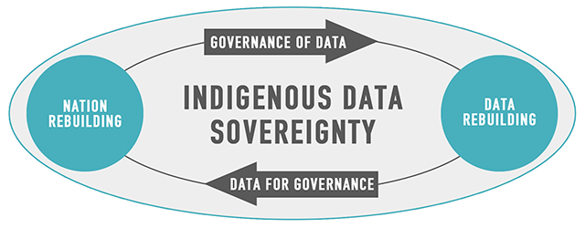

# Data Sovereignty and Governance
Data collection, analysis and sharing is couched in historic inequities, some of which Open Data can exacerbate. Data Sovereignty addresses aspects of data inequality, and may place limits on what data can be shared and by whom.

**Data sovereignty**: The right of a community and/or nation to maintain that data  is managed in a way that is consistent with the laws, practices and customs of that community ([Snipp 2016](https://static1.squarespace.com/static/5d2633cb0ef5e4000134fa02/t/5d7a7610da91c0143184a9d1/1568306712324/Indigenous%2BData%2BSovereignty%2BBook.pdf), pg. 39). 

**Data governance**: "the power to decide how and when Indigenous data are gathered, analysed, accessed and used" (Walter et al. 2018, p. 3).

For background on these terms see [Carroll, Rodriguez-Lonebear, and Martinez 2019](https://datascience.codata.org/articles/10.5334/dsj-2019-031/).


## Data Sovereignty
#### [Indigenous Data Sovereignty](https://static1.squarespace.com/static/5d2633cb0ef5e4000134fa02/t/5d7a7610da91c0143184a9d1/1568306712324/Indigenous%2BData%2BSovereignty%2BBook.pdf): Toward an Agenda {-}
Tahu Kukutai and John Taylor. *ANU Press*, 2016. 

*Indigenous Data Sovereignty* is a book published in 2016 and is a collaboration between Indigenous scholars from Anglo-Settler states (CANSUZ), Australia, Aotearoa, the U.S. and Canada. There are 16 chapters, in which each can stand alone.

#### [Indigenous Data Sovereignty](https://www.youtube.com/watch?v=RjolET69Z8c): How Researchers can Empower Data Governance {-}
Lydia Jennings. *NCEAS Seminar Series*. 2021. 

In a NCEAS seminar, Lydia Jennings (Postdoc UofA, Collaboratory for Indigenous Data Governance), provides an overview of Indigenous Data Sovereignty, especially as it pertains to environmental science.

#### "[Being in Good Community: Engagement in Support of Indigenous Sovereignty](https://www.tandfonline.com/doi/full/10.1080/15265161.2021.1965243)"{-}
Jessica Blanchard and Vanessa Hiratsuka. *The American Journal of Bioethics* 21.10. 54-56. 2021.

Blanchard and Hiratsuka, researchers at The Center for the Ethics of Indigenous Genomic Research (CEIGR), advocate for the assertion of tribal sovereignty as a guiding principle for more ethical, community-engaged research with tribes.

#### "[Indigenous data sovereignty](https://open.spotify.com/episode/3T7XBXU28bghKTPlowEuHL?si=SbeZZ12FQrSC0zbNkt4REA&nd=1)"{-} 
*IndigenousX Presents: Blak Nation*. August 31, 2021.  

Blak Nation’s “Indigenous data sovereignty” is a podcast episode that interviews Dr. Maggie Walter, co-author of Indigenous Statistics, Dr. Maui Hudson (Professor and Director or Te Kotahi Research Institute), Dr. Jane Anderson (Professor at NYU and co-founder of Local Contexts), and Dr. Kalinda Griffiths (Scientia Lecturer at Centre for Big Data Research in Health, UNSW Sydney). Dr. Walter opens the podcast with an overview of the Indigenous Data Sovereignty movement, while Hudson, Anderson and Griffiths provide specific examples.


#### "[Indigenous data sovereignty in the era of big data and open data](https://onlinelibrary.wiley.com/doi/full/10.1002/ajs4.141)"{-} 
Maggie Walter et al. *Australian Journal of Social Issues* 56.2: 143-156. 2021. 

Abstract: "Indigenous Data Sovereignty, in its proclamation of the right of Indigenous peoples to govern the collection, ownership, and application of data, recognises data as a cultural and economic asset. The impact of data is magnified by the emergence of Big Data and the associated impetus to open publicly held data (Open Data). Aboriginal and Torres Strait Islander peoples, families and communities, heavily overrepresented in social disadvantage–related data will also be overrepresented in the application of these new technologies, but in a data landscape, Indigenous peoples remain largely alienated from the use of data and its utilization within the channels of policy power. Existing data infrastructure, and the emerging Open Data infrastructure, neither recognise Indigenous agency and worldviews nor consider Indigenous data needs. This is demonstrated in the absence of any consideration of Indigenous data issues in Open Data discussions and publication. Thus, while the potential benefits of this data revolution are trumpeted, our marginalised social, cultural and political location suggests we will not share equally in these benefits. This paper discusses the unforeseen (and likely unseen) consequences of the influence of Open Data and Big Data and discusses how Indigenous Data Sovereignty can mediate risks while providing pathways to collective benefits."


## Data Governance
#### "[Indigenous Data Governance](https://datascience.codata.org/articles/10.5334/dsj-2019-031/): Strategies from United States Native Nations" {-} 
Stephanie Russo Carroll, Desi Rodriguez-Lonebear, and Andrew Martinez. *Data Science Journal*, 18(1), p.31. 2019.

This review paper argues for the repositioning of authority over Indigenous data back to Indigenous peoples through context setting and case studies. For those wanting an overview to these concepts, Carroll, Rodriguez-Lonebear and Martinez provide an especially background of key terms related to data sovereignty and data governance.

```{r echo = FALSE, , fig.cap = "Building Indigenous data soverigenty through Indigenous data governance"}



```

#### "[The voice of indigenous data: beyond the markers of disadvantage](https://www.griffithreview.com/articles/voice-indigenous-data-beyond-disadvantage/)" {-} 
Maggie Walter. *Griffith Review* 60: 256-263. 2018.

Maggie Walter outlines the Indigenous Data Paradox: there is both too much data about Aboriginal and Torres Strait Islander people but almost no data for or by Aboriginal and Torres Strait Islander people. Walter then maps these data failures across data categories, ultimately calling for a change in the paradigm of Indigenous data. 

#### “[First Nations data sovereignty](https://open.spotify.com/episode/7lpJvcWPEX0DJcMjQPTdiK?si=r3AfZ-SbQeu3KrMtPbK6cQ)" {-}
*Info Matters*. August 2021.  

Info Matters is a podcast by the Information and Privacy Commissioner of Ontario, Canada, Patricia Kosseim. In this episode, Kosseim interviews Dr. Jonathan Dewer, Chief Executive Officer of the First Nations Information Governance Center, and Carmen Jones, Director of Research and Data Management for the Chief of Ontario. Dewar and Jones provide unique insight into data sovereignty broadly and specifically the creation and implementation of OCAP Principals (14:15).

#### "[Good data practices for Indigenous data sovereignty and governance](https://books.google.com/books?hl=en&lr=&id=Y0vUDwAAQBAJ&oi=fnd&pg=PA26&dq=Good+data+practices+for+Indigenous+data+sovereignty+and+governance&ots=hr9XhjlbCh&sig=QKNc1PnCBYMO2s1mHYWbRg6g_GU#v=onepage&q=Good%20data%20practices%20for%20Indigenous%20data%20sovereignty%20and%20governance&f=false)" {-}
Raymond Lovett et al. *Good Data*: 26-36. 2019. 

“This chapter aims to provide clarity concerning the definitions of Indigenous Data Sovereignty (IDS) and Indigenous Data Governance (IDG); provide an overview of the historical context in which IDS has emerged; and provide examples of IDS and IDG across the spectrum of community, policy, and practice.”


## The CARE Principles for Indigenous Data Governance

#### "[The CARE Principles for Indigenous Data Governance](http://doi.org/10.5334/dsj-2020-043)" {-} 
Carroll, Stephanie Russo, Ibrahim Garba, Oscar L. Figueroa-Rodríguez, Jarita Holbrook, Raymond Lovett, Simeon Materechera, Mark Parsons, Kay Raseroka, Desi Rodriguez-Lonebear, Robyn Rowe, Rodrigo Sara, Jennifer D. Walker, Jane Anderson, Maui Hudson. *Data Science Journal*, 19(1), p.43. 2020 

The ‘CARE Principles for Indigenous Data Governance’ (Collective Benefit, Authority to Control, Responsibility, and Ethics) were developed due to concerns about secondary use of data and limited opportunities for benefit-sharing between Indigenous communities and outside researchers. While the FAIR Principles are data-centric, the CARE Principles are people and purpose oriented. The authors write, "the goal is that stewards and other users of Indigenous data will ‘Be FAIR and CARE.’" CARE principles are intended to be used in concert with FAIR Principals. Of particular note, this paper also provides an important background on Indigenous data sovereignty.

```{r echo=FALSE, fig.cap = "Indigenous and mainstream data principles, and the orientation of these principles towards data, people and purpose (Carroll et al. 2020)."}

knitr::include_graphics("images/care.png")


```

#### "[Operationalizing the CARE and FAIR Principles for Indigenous data futures](https://doi.org/10.1038/s41597-021-00892-0)"{-}  
Stephanie Russo Carroll, et al. *Scientific Data* 8, no. 1. 2021.

CARE Principles place emphasis on placing intention and human well-being at the forefront of data publishing and sharing. While FAIR principles are often used in the context of open science, they differ from open science, and represent guidelines for publishing data that can be easily interpreted, stand the test of time, and reused if applicable. Together, CARE and FAIR principles speak to clean, well-managed data that puts human well-being first.


#### "[Using Indigenous Standards to Implement the CARE Principles: Setting Expectations through Tribal Research Codes](https://www.frontiersin.org/articles/10.3389/fgene.2022.823309/full?&utm_source=Email_to_authors_&utm_medium=Email&utm_content=T1_11.5e1_author&utm_campaign=Email_publication&field=&journalName=Frontiers_in_Genetics&id=823309)" {-} 
Stephanie Russo Carroll, et al. *Frontiers in Genetics* 489. 2022.

Abstract Excerpt: "This article outlines the relationship between sovereignty and ethics in the context of data to describe the collective rights that Indigenous Peoples assert to increase control over their biomedical data. Then drawing on the CARE Principles for Indigenous Data Governance (Collective benefit, Authority to control, Responsibility, and Ethics), we explore how standards already set by Native nations in the United States, such as tribal research codes, provide direction for implementation of the CARE Principles to complement FAIR. A broader approach to policy and procedure regarding tribal participation in biomedical research is required and we make recommendations for tribes, institutions, and ethical practice."

## OCAP Principals
#### [OCAP - First Nations Ownership, Control, Access and Possession or Self Determination Applied to Research (2004)](https://biblio.uottawa.ca/sites/biblio.uottawa.ca/files/bestpractices_fnigc_ocap_fact_sheet_en_final.pdf) {-}
The OCAP Principals were first developed in 1998 in response to extractive research practices. "These principals establish how First Nations' data, information, and cultural knowledge should be collected, accessed, used, and shared."

#### [Fundamentals of OCAP Course](https://fnigc.ca/ocap-training/take-the-course/) {-} 
An online training course to introduce individuals to the fundamental concepts of OCAP, information governance, and First Nations Data Sovereignty.


