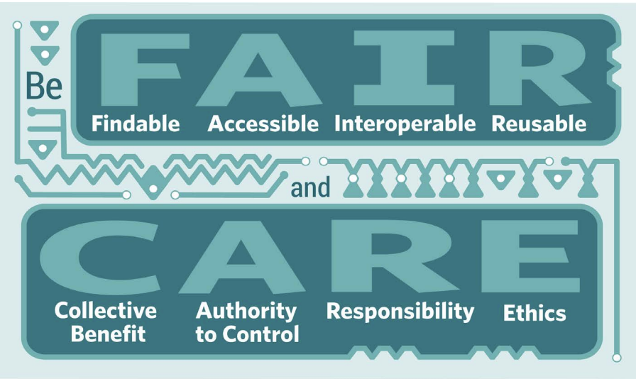

```{r setup, include=FALSE}
knitr::opts_chunk$set(echo = TRUE)
```

# IDS (Indigenous Data Sovereignty) Frameworks & Networks
International and nation-state networks of practitioners and researchers have formed to share and develop frameworks, resources and training on data management and governance. These networks are critical to create a community of Indigenous scholars and stewards invested in furthering responsible Indigenous data, collection and data sovereignty. As part of this work, data networks have created frameworks that inform data management from a global to community scales. Global high-level, frameworks are more general in nature (e.g. [CARE Principals](https://static1.squarespace.com/static/5d3799de845604000199cd24/t/5da9f4479ecab221ce848fb2/1571419335217/CARE+Principles_One+Pagers+FINAL_Oct_17_2019.pdf)), while, more specific mid-level frameworks have been developed by nation-state networks or by subsets of Indigenous Peoples/Nations (such as circumpolar Inuit or Inuit within the national level in Canada). Foundational frameworks have been developed at the Tribal or community scale.

Different frameworks can inform and guide ethical data management. Frameworks at the community scale supersede more general frameworks. However, in the absence of a written framework at the tribal or community scale, engagement outlined in mid-level frameworks paired with community consultation can help inform the development of an ethical approach. For a practical overview of open science, data sovereignty and co-production geared towards researchers, see the Arctic Data Center workshop guide ["Open Science: Best Practices, Data Sovereignty and Co-production"](https://learning.nceas.ucsb.edu/2022-03-assw/index.html).


## Overview of Indigenous data sovereignty networks {-}
- International Groups
  - The Global Indigenous Data Alliance [GIDA](https://www.gida-global.org/)
  - International Indigenous Data Sovereignty Interest Group: Research Data Alliance ([RDA](https://www.rd-alliance.org/groups/international-indigenous-data-sovereignty-ig))
- Anglo-settler state data sovereignty networks
  - [U.S. Indigenous Data Sovereignty Network](https://usindigenousdata.org/)
  - [Te Mana Raraunga](https://www.temanararaunga.maori.nz/) – Māori Data Sovereignty Network
  - [The Maiam nayri Wingara Indigneous Data Sovereignty Collective](https://www.maiamnayriwingara.org/)

#### The Global Indigenous Data Alliance ([GIDA](https://www.gida-global.org/)) {-}
Shares frameworks, tools, and processes to help guide the practice of Indigenous Data Sovereignty around the globe. Notably, GIDA created the [CARE principles](https://www.gida-global.org/care) for Indigenous Data Governance \@ref(3.3). 

```{r echo=FALSE, fig.cap = "The CARE and FAIR Principals (GIDA 2019)."}




```


#### Research Data Alliance ([RDA](https://www.rd-alliance.org/groups/international-indigenous-data-sovereignty-ig)): International Indigenous Data Sovereignty Interest Group  {-} 
Builds the social and technical bridges to enable open sharing and re-use of data


