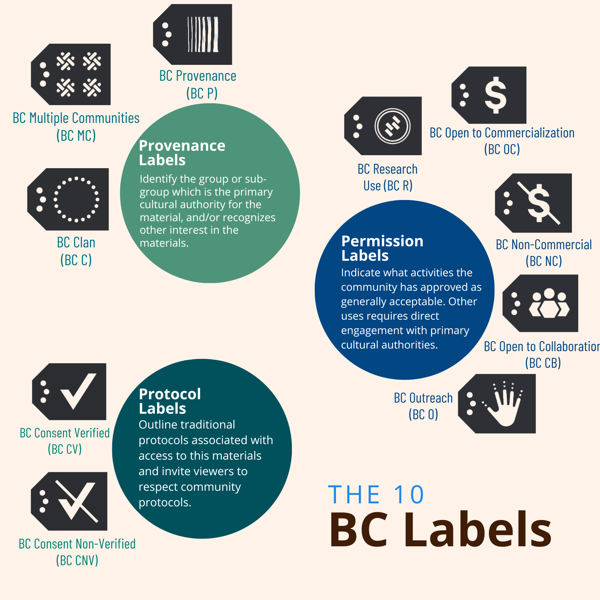

# Data Management Tools
Thus far, the data management tools we've come across have largely been developed by [Local Contexts](https://localcontexts.org/labels/biocultural-labels/). If you have examples of other practical tools or organizations that develop them, please share!

## Data Labels and Notices
Data labels are text elements that describe individual data points. They are used on metadata as a tag that can be easily categorized and searched. Notices, also a type of data label, function as place holders for more permanent labels.

### Traditional Knowledge and BioCultural Labels and Notices
[Traditional Knowledge (TK) Labels](https://localcontexts.org/labels/traditional-knowledge-labels/) and [Biocultural (BC) Labels](https://localcontexts.org/labels/biocultural-labels/) are a collective set of 30 of data-markers developed by [Local Contexts](https://localcontexts.org/) and partner communities. These 30 labels should be tagged by Indigenous communities. External groups, such as researchers, scientists, and museums, may apply [Notices](https://localcontexts.org/notices/aboutnotices/), specific tools which support the recognition of Indigenous interests in collections and data. The Notices can function as place-holders on collections, data, or in a sample field until a more permanent label is added by a community. There are four Notices developed by Local Contexts and their community partners: the TK Notice and the BC Notice (these align to the TK and BC Labels), the Attribution Incomplete Notice and the Open to Collaboration Notice. 

**TK Labels** define "attribution, access, and use rights for Indigenous cultural heritage. Twenty TK Labels have been developed through direct community partnership and collaboration. Each TK Label can be adapted and customized to reflect ongoing relationships and authority including proper use, guidelines for action, or responsible stewardship and re-use." (Local Contexts, TK Labels)

**BC Labels** define "community expectations and consent about appropriate use of collections and data. They connect data to people and environments over time. Ten BC Labels provide a practical application of Indigenous data governance principles to issues of access and benefit-sharing for genetic resources." (Local Contexts, BC Labels)


```{r echo=FALSE, fig.cap = "The 10 BC Labels developed by Jane Anderson and Maui Hudson, adapted by Phoebe Racine"}


```
If you would like to learn more about these Labels and are a researcher, consider signing up to test the new [Local Contexts Hub](https://anth-ja77-lc-dev-42d5.uc.r.appspot.com/login/).

#### [Sharing Our Gifts: An Indigenous-led curriculum response at Western University](https://teaching.uwo.ca/teaching/indigenous-tl-resources.html) {-}
Dr. Janette Hamilton Pearce, Felicia Garcia, Corrie Roe. June 22, 2022.

This presentation by Local Contexts provides an overview of the TK and BC Labels and Notices, the Local Contexts Initiative and Local Contexts Hub.

#### [The Biocultural Labels Initiative](https://qubeshub.org/publications/2326/1) {-}
Jane Anderson and Maui Hudson. *STEM Inclusive Teaching Practices Webinar Series*. 2021.  

This webinar series is geared towards facilitating inclusive teaching practices with undergraduates. Here, Jane Anderson and Maui Hudson introduce Biocultural Labels and the work of Local Contexts. 

## Indigenous Digital Strategies
#### [Local Contexts](https://localcontexts.org/labels/biocultural-labels/) {-}
Local Contexts is an organization that offers digital strategies for Indigenous communities, cultural institutions and researchers through Traditional Knowledge and Biocultural Labels and Notices and licenses for intellectual property. 

