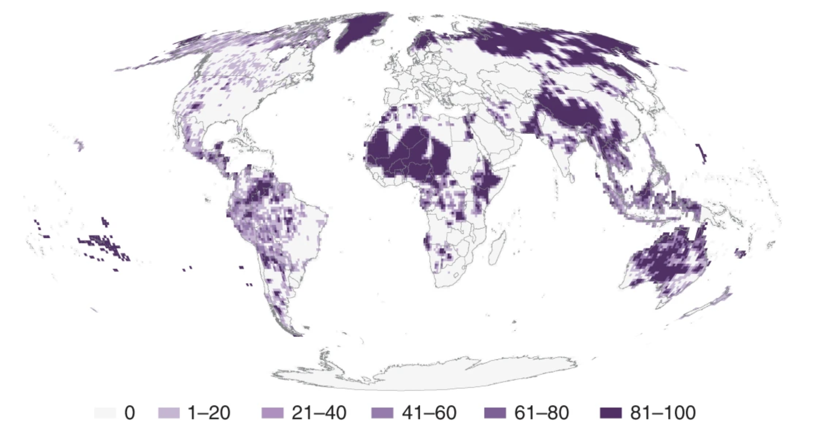

# Examples of Indigenous Environmental Synthesis and Data Science

## Environmental Synthesis
#### "[A spatial overview of the global importance of Indigenous lands for conservation](https://www.nature.com/articles/s41893-018-0100-6?ss_source=sscampaigns&ss_campaign_id=5c424fe9d20e280001eb02bf&ss_email_id=5c5cf4c39bca21000175c9fd&ss_campaign_name=Introducing+the+Interfaith+Rainforest+Initiative&ss_campaign_sent_date=2019-02-08T03:17:24Z)" {-}
Garnett, Stephen T., et al. *Nature Sustainability* 1.7: 369-374. 2018. 

This paper provides the first global assessment of global lands within Indigenous stewardship and their overlap with protected areas and conservation outcomes. The authors found that Indigenous Peoples have tenure rights or actively manage more than a quarter of the world's land surface (~38 million km^2^ across 87 countries). Indigenous managed lands account for about 40% of all terrestrial protected areas and ecologically intact landscapes (for example, boreal and tropical primary forests, savannas and marshes). Thus, indigenous stewarded lands are critical hubs for biodiversity and resilience. 

To create this global assessment, the authors rely on 127 publicly available data sources, including real estate (cadastral) records for state-recognized Indigenous Peoples’ lands, publicly accessible participatory mapping, models based on census data and maps derived from scholarly publications. Here, the authors worked to overcome some of the inherent biases in Indigenous geospatial data. Data of Indigenous Peoples’ land occupation or management tend to rely on state-sanctioned data that can be deployed to disenfranchise Indigenous Peoples ([Bryan 2011](https://www.sciencedirect.com/science/article/pii/S0016718510001090?via%3Dihub); Garnett et al. 2018). The authors write, "the dearth of reliable data on Indigenous Peoples’ lands in many parts of the world has implications not only for securing their rights but also for the conservation and management of a significant proportion of terrestrial global biodiversity."

```{r echo=FALSE, fig.cap = "Global map of lands managed or controlled by Indigenous Peoples. Purple shading represents the percentage of each degree square mapped as Indigenous in at least one of 127 source documents. Blank areas do not necessarily indicate an absence of Indigenous Peoples or lands (Figure 1, Garnett et al. 2018)."}




```


## Indigenous Environmental Data
#### "[Indigenous Climate Knowledge and Data Sovereignty](https://open.spotify.com/episode/4Gdp1RSChCPM0qftRun3DD?si=pcVeYiwwQIWnlKynt4-ADQ)" {-}
*Warm Regards*.  February 2021.

Warm Regards is a podcast about life on a warming planet. In this episode, the hosts interview two Indigenous scientists, James Rattling Leaf, Sr. and Krystal Tsosie, about traditional ecological knowledges and data sovereignty.
 
## Traditional Ecological Knowledge (TEK) applications to management 
Below are a couple examples which speak to how TEK and other forms of knowledge, such as western science, can work together to increase understanding and improve land stewardship.

#### "[Learning from Indigenous knowledge holders on the state and future of wild Pacific salmon](https://theconversation.com/learning-from-indigenous-knowledge-holders-on-the-state-and-future-of-wild-pacific-salmon-182411)" {-}
Andrea Reid. *The Conversation*. May 2022. 

Andrea Reid, a member of the Nisga'a Nation and Director for the Centre of Indigenous Fisheries at University of British Columbia, writes about her experience working with Nisga'a Nation tribal elders to understand threats to salmon. She provides an overview of the issues with much of western science's approach when working with TEK and explains her current research in a brief narrative. For scholarly examples of Indigenous fisheries science, see Dr. Reid's [work](https://scholar.google.com/citations?hl=en&user=WWdYxJgAAAAJ).

#### "“[Two‐Eyed Seeing”: An Indigenous framework to transform fisheries research and management](https://onlinelibrary.wiley.com/doi/full/10.1111/faf.12516)." {-}
Andrea J. Reid, et al. *Fish and Fisheries* 22.2: 243-261. 2021.

Highly relevant to current shifts in ecosystem management, Reid et al. (2021) suggests a framework, Two-Eyed Seeing, in order to understand and steward fisheries. Rather than assimilating Indigenous knowledge systems into western science, Two-Eyed Seeing embraces "learning to see from one eye with the strengths of Indigenous knowledges and ways of knowing, and from the other eye with the strengths of mainstream knowledges and ways of knowing, and to use both these eyes together, for the benefit of all” (Elder Dr. Albert Marshall; Reid et al. 2021).
```{r echo=FALSE, fig.cap = ""A conceptual framework detailing the flow of knowledge (Indigenous knowledge (IK); Western science (WS)) that underpins researchers’ understandings or views of reality, and ultimately guides their research and management decisions, as classified under three main archetypes." (Figure 3, Reid et al. 2021)"}

knitr::include_graphics("images/Reid_2021.png")


```

#### "[Unsettling marine conservation: Disrupting manifest destiny-based conservation practices through the operationalization of Indigenous value systems]((https://escholarship.org/uc/item/3sm1f1vq))" {-}
Lara A. Jacobs, et al. *Parks Stewardship Forum*. Vol. 38. No. 2. 2022. 

*Abstract exert*: "This paper is written by Indigenous scholars using Two-Eyed Seeing, reflexivity, and decolonizing methods (e.g., symbology, storytelling, and Indigenous beading) to unsettle the ways that marine conservation should be facilitated. Our framework operationalizes Indigenous value systems embedded within “the seven R’s”: respect, relevancy, reciprocity, responsibility, rights, reconciliation through redistribution, and relationships. This framework underlines the need for marine conservation efforts to center Indigenous voices and futures and Tribal management of marine systems. Marine system managers can use this paper as a guide for decolonizing marine conservation approaches, operationalizing Indigenous value systems in marine management, and building decolonial relationships with Indigenous Peoples and waters." (Jacobs et al., 2022)

## Resource Management Networks
#### [Indigenous Aquaculture Collaborative](https://indigenousaquaculture.org/) {-}
"We are a collaborative network of Pacific-region Sea Grant offices; Northwest Tribes and First Nations, Native Hawaiian and Indigenous communities; and organizations and universities working as a community of practice to advance Indigenous Aquaculture. We integrate community engagement, restoration, applied research, and education to share experiences, knowledge, and strategies that enhance local and cultural seafood production in the broader Pacific region. The focal knowledge, practices, and relationships of our network are part of deep heritages that are rooted in local bays, inlets, watersheds, and islands. While these cultural ecosystems have been here for a very long time, our collaborative cross-Pacific network started in 2019, building upon our existing relationships. As a network, we share the living traditions from our unique places to develop strong cross-cultural learning and support collective efforts." (Indigenous Aquaculture Collaborative, "About Us")


*If you are aware of other examples of Indigenous resource management, please share!*

