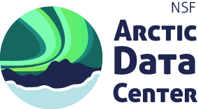
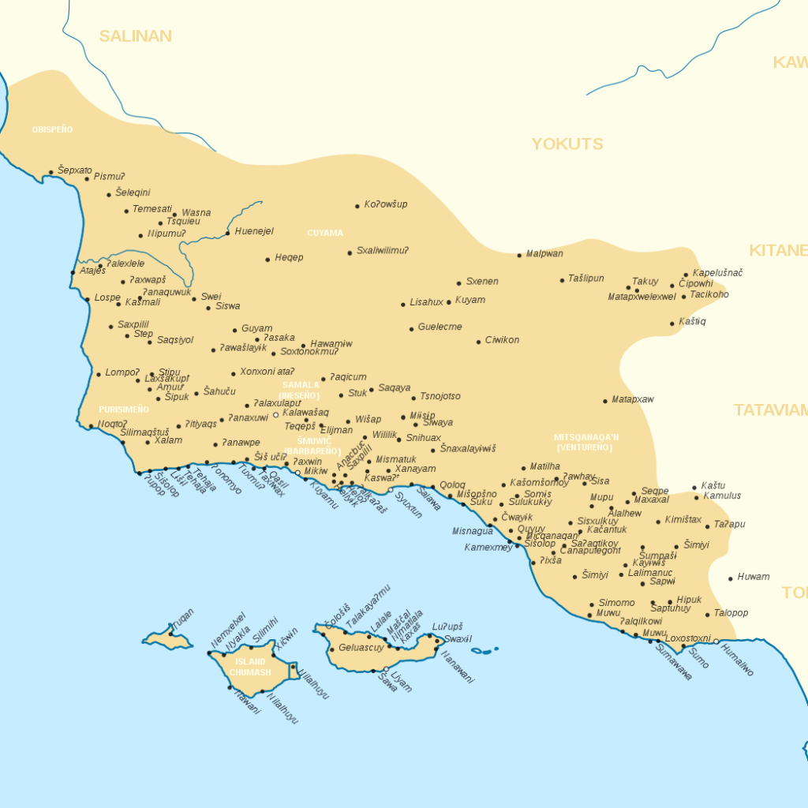

--- 
title: "Indigenous Data Sovereignty and Open Data in Environmental Sciences"
date: "`r Sys.Date()`"
site: bookdown::bookdown_site
documentclass: book
bibliography: [book.bib, packages.bib]
#url: https://bookdown.org/pracine/bookdown
# url: your book url like https://bookdown.org/yihui/bookdown
# cover-image: path to the social sharing image like images/cover.jpg
description: |
  This is a minimal example of using the bookdown package to write a book.
  The HTML output format for this example is bookdown::gitbook,
  set in the _output.yml file.
link-citations: yes
#github-repo: rstudio/bookdown-demo
---

# About this book {-}

This is an evolving reading list geared towards understanding the ethical concerns and best practices of data collection, management, and analysis especially as it pertains to working with Indigenous peoples and environmental science and management. {*explain tension between Indigenous data soverigenty + open data in environmental science*}. Here, you’ll find an overview of data sovereignty networks, and a collection of podcasts, seminars, tools, books and peer-reviewed papers. If you’re aware of a resource that would fit in well or have other feedback, please share!

This reading list reflects the continuous development of learning materials at the Arctic Data Center and National Center for Ecological Analysis and Synthesis (NCEAS) to support researchers and practitioners to understand, adopt, and apply ethical open science practices. In bringing these materials together we recognize that many individuals have contributed to their development. The primary authors are listed in the citation below, with additional contributors recognized for their role in guiding the development of the document or by developing previous iterations.

**Citation**: Phoebe Racine & Natasha Haycock-Chavez. 2022. Indigenous Data Sovereignty and Open Data in Environmental Sciences.

**Additional contributors**: Nākoa Farrant, Ben Halpern, Matt Jones


```{r echo=FALSE, out.width="49%"}

```

```{r echo=FALSE, out.width="49%"}
knitr::include_graphics("images/nceas.png")
```


## Land Acknowledgement {-}

This book was created on unceded Chumash ancestral lands in gratitude and solidarity with all our relations. We are committed to learning about how to implement Indigenous Data Sovereignty within our own institutions and in the trainings that Arctic Data Centers offers the Arctic research community.

The Chumash people are comprised of the descendants of Indigenous peoples removed from their Island of origin [Limuw (Santa Cruz), Anyapac (Anacapa), Wima (Santa Rosa) and Tuqan (San Miguel)](https://external.as.ucsb.edu/land-acknowledgment/) subjugated by 5 missions during Spanish colonization of the Central Coast. Chumash Territory stretches from Malibu to Morro Bay and inland to Bakersfield, encompassing [7,000 square miles](https://www.santaynezchumash.org/chumash-history). The Villages, upon which University of California Santa Barbara sits, were a traditional place of knowledge sharing, education, trading and abundance.

```{r echo=FALSE, fig.cap= "Map of Chumash Villages [source: Wikipedia Commons](https://commons.wikimedia.org/wiki/File:Chumash_villages.svg)"} 



```

If you are interested in learning more about the Chumash and how to support them, please visit their website [here](https://www.wishtoyo.org/).
